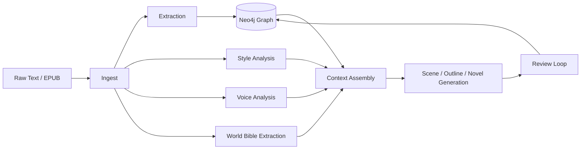

# Architecture

## Pipeline Overview



This graph-backed pipeline keeps generation grounded in extracted canon.

---

## World-Building Layers

!!! note "Milestone: Tolkien World-Building (#45–#51)"
    The pipeline is being extended with five deep world-building layers that
    integrate into the existing modules rather than forming a separate stack.
    See the full [World-Building RFC](tolkien-worldbuilding-rfc.md) for details.

```mermaid
flowchart TB
  subgraph Existing["Existing Pipeline"]
    ingest[Ingest] --> extract[Extract]
    extract --> graph[Graph Writer]
    graph --> lore[Lore Checker]
    lore --> generate[Generate]
  end

  subgraph WorldBuilding["World-Building Layers"]
    WB1[Linguistic Lineage<br/>#46]
    WB2[Deep Genealogy<br/>#47]
    WB3[Editorial Layers<br/>#48]
    WB4[Cultural Rules<br/>#49]
    WB5[Cosmological Timeline<br/>#50]
  end

  extract -.->|language-aware aliases| WB1
  graph -.->|genealogy edges| WB2
  ingest -.->|source tagging| WB3
  lore -.->|culture-scoped rules| WB4
  graph -.->|extended era chain| WB5
```

### Integration Points

Each world-building pillar extends an existing module:

| Pillar | Primary Module | Extension |
|--------|---------------|-----------|
| Linguistic Lineage | `extract.resolver` | Language-aware alias resolution |
| Deep Genealogy | `graph.writer` | `write_genealogy_batch()` with generational metadata |
| Editorial Layers | `ingest.loader` | Source-text provenance tagging |
| Cultural Rules | `lore.rules` | Culture-scoped `LoreRule` instances |
| Cosmological Timeline | `graph.temporal` | Pre-First-Age era support |

### New Model Types

Three new model families live in `models.worldbuilding`:

- **`LinguisticLineage`** / **`LanguageForm`** — Etymology chains across Tolkien's languages
- **`GenealogyRelation`** — Family relationships with generational depth and house membership
- **`EditorialLayer`** — Source-text provenance (published, draft, notes, letters)

These models are pure Pydantic/dataclass with no LLM dependency.
See [Data Model](DATA_MODEL.md#world-building-extensions) for schema details.
