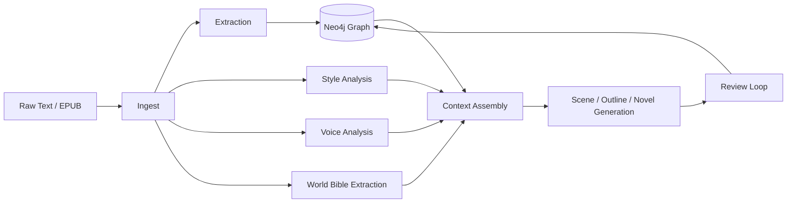

# Architecture

```mermaid
flowchart LR
  A[Raw Text / EPUB] --> B[Ingest]
  B --> C[Extraction]
  C --> D[(Neo4j Graph)]
  B --> E[Style Analysis]
  B --> F[Voice Analysis]
  B --> G[World Bible Extraction]
  D --> H[Context Assembly]
  E --> H
  F --> H
  G --> H
  H --> I[Scene / Outline / Novel Generation]
  I --> J[Review Loop]
  J --> D
```

This graph-backed pipeline keeps generation grounded in extracted canon.
