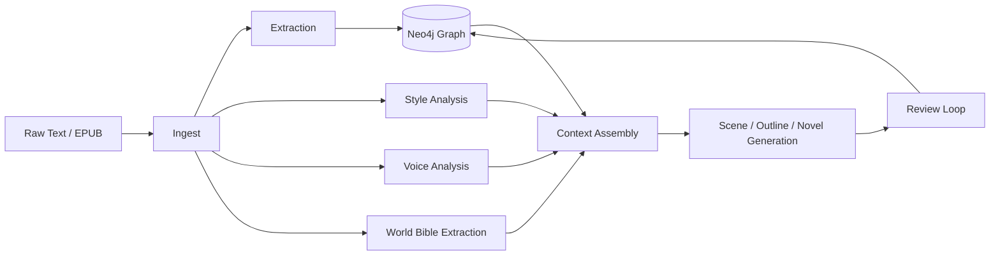

# Architecture

## Pipeline Overview



This graph-backed pipeline keeps generation grounded in extracted canon.

---

## World-Building Layers

!!! note "Milestone: Tolkien World-Building (#45–#51)"
    The pipeline is being extended with five deep world-building layers that
    integrate into the existing modules rather than forming a separate stack.
    See the full [World-Building RFC](tolkien-worldbuilding-rfc.md) for details.

```mermaid
flowchart TB
  subgraph Existing["Existing Pipeline"]
    ingest[Ingest] --> extract[Extract]
    extract --> graph[Graph Writer]
    graph --> lore[Lore Checker]
    lore --> generate[Generate]
  end

  subgraph WorldBuilding["World-Building Layers"]
    WB1[Linguistic Lineage<br/>#46]
    WB2[Deep Genealogy<br/>#47]
    WB3[Editorial Layers<br/>#48]
    WB4[Cultural Rules<br/>#49]
    WB5[Cosmological Timeline<br/>#50]
  end

  extract -.->|language-aware aliases| WB1
  graph -.->|genealogy edges| WB2
  ingest -.->|source tagging| WB3
  lore -.->|culture-scoped rules| WB4
  graph -.->|extended era chain| WB5
```

### Integration Points

Each world-building pillar extends an existing module:

| Pillar | Primary Module | Extension |
|--------|---------------|-----------|
| Linguistic Lineage | `extract.resolver` | Language-aware alias resolution |
| Deep Genealogy | `graph.writer` | `write_genealogy_batch()` with generational metadata |
| Editorial Layers | `ingest.loader` | Source-text provenance tagging |
| Cultural Rules | `lore.rules` | Culture-scoped `LoreRule` instances |
| Cosmological Timeline | `graph.temporal` | Pre-First-Age era support |

### New Model Types

Three new model families live in `models.worldbuilding`:

- **`LinguisticLineage`** / **`LanguageForm`** — Etymology chains across Tolkien's languages
- **`GenealogyRelation`** — Family relationships with generational depth and house membership
- **`EditorialLayer`** — Source-text provenance (published, draft, notes, letters)

These models are pure Pydantic/dataclass with no LLM dependency.
See [Data Model](DATA_MODEL.md#world-building-extensions) for schema details.

### Spatiotemporal Engine (#48)

A new `spatiotemporal` package provides cartography + interlaced timeline reconciliation:

```
spatiotemporal/
  models.py              # NormalizedTime, SpatiotemporalEvent, LocationNode/Edge,
                         # TimelineConflict, CausalLink (slice 3)
  normalizer.py          # Parse temporal expressions → NormalizedTime
  conflict_detector.py   # Detect overlaps, infeasible travel, era mismatches,
                         # causal paradoxes + cycle detection (slice 3)
  report.py              # Human-readable reconciliation reports
  extraction_bridge.py   # Bridge lore Events → SpatiotemporalEvents (slice 2)
  causal_extraction.py   # Heuristic CausalLink extraction from events (slice 4)
  corpus_reconciler.py   # Cross-book timeline reconciliation (slice 4)
```

**Integration points:**
- `graph.writer` — `write_spatiotemporal_event()`, `write_location_graph()`,
  `query_conflicting_overlaps()`, `query_travel_infeasibility()`,
  `write_timeline_conflict()`, `write_timeline_conflicts_batch()`,
  `query_timeline_conflicts()`, `query_recent_critical_conflicts()` (slice 3),
  `write_causal_link()`, `write_causal_links_batch()`,
  `query_causal_chain()`, `query_causal_violations()` (slice 4)
- `cli.py` — `bga lore timeline-reconcile`, `bga lore timeline-bridge` (+ `--causal-links`),
  `bga lore timeline-conflicts` (slice 3), `bga corpus timeline-reconcile` (slice 4)
- Builds on existing `graph.temporal` era ordering and `TemporalValidity`

**Slice 3 additions (causal paradox detection + Neo4j persistence):**
- `CausalLink` model: declares "event A causes event B"
- `ConflictDetector._detect_causal_paradoxes()`: finds effect-before-cause violations
  and cycles in causal graphs via DFS
- `GraphWriter.write_timeline_conflict()`: idempotent MERGE of TimelineConflict nodes
  with INVOLVES edges to SpatiotemporalEvent nodes
- `bga lore timeline-bridge --write-neo4j`: persist events + conflicts to Neo4j
- `bga lore timeline-conflicts`: query persisted conflicts by type/severity/entity

**Slice 4 additions (causal extraction + cross-book reconciliation):**
- `causal_extraction.extract_causal_links_heuristic()`: heuristic CausalLink extraction
  from SpatiotemporalEvents using causal signal words (no LLM required)
- `CorpusReconciler`: cross-book timeline reconciliation with per-book and cross-book
  conflict detection, integrated causal link extraction
- `GraphWriter.write_causal_link()`: persists CausalLink as `:CausalLink` node + `:CAUSES` edge
- `GraphWriter.query_causal_chain()`: traverse causal chains forward/backward
- `GraphWriter.query_causal_violations()`: find causal paradoxes in persisted graph
- `bga lore timeline-bridge --causal-links`: extract + check causal links
- `bga corpus timeline-reconcile`: cross-book reconciliation with summary + JSON output
- TODO(#48): LLM-assisted causal extraction for higher quality links
- TODO(#48): Confidence calibration across source authority weights

See [Pipeline docs](pipeline.md#timeline-reconciliation) for usage.
